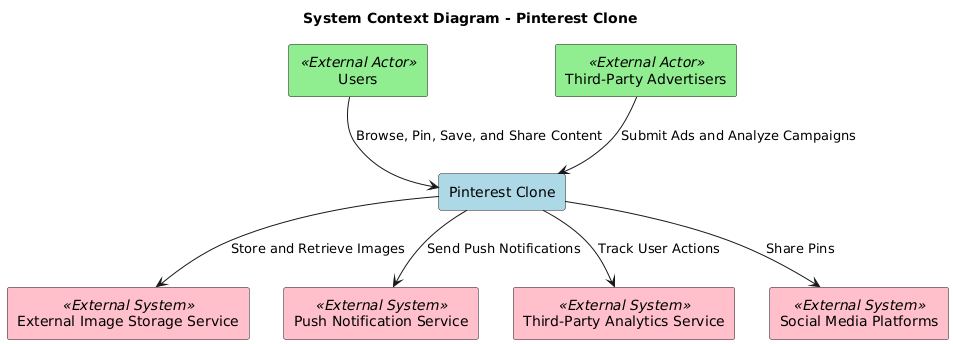
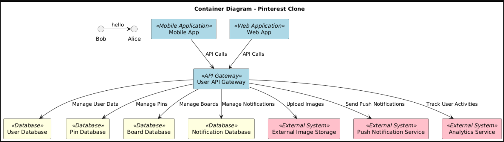
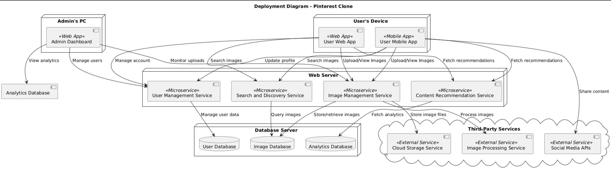

# Pinterest Clone Architecture

## 1. System Context Diagram

The System Context Diagram provides an overview of Pinterest, showing how external users and systems interact with the application. Key external actors include:
- **Users**: Create, view, and share pins and boards.
- **Advertisers**: Promote content on Pinterest.
- **Third-party APIs**: Enable integration with external platforms like social media and payment gateways.

---

## 2. Container Diagram

The Container Diagram highlights the primary containers within Pinterest:
- **Web and Mobile Applications**: User-facing interfaces for interacting with Pinterest.
- **Backend Services**: Responsible for processing user requests, managing content, and providing recommendations.
- **Databases**: Store data related to users, pins, boards, and analytics.

---

## 3. Component Diagrams

### 3.1 Component Diagram for Users

The User Component Diagram illustrates the interaction flow for regular Pinterest users:
- **Login and Registration**: Handles user authentication.
- **Pin Management**: Allows users to create, view, and save pins.
- **Board Management**: Enables organization of pins into boards.
- **Recommendations**: Provides personalized pin and board suggestions.
- **Notifications**: Sends alerts to users about activities on their pins or boards.

---

### 3.2 Component Diagram for Admin

The Admin Component Diagram represents features available for Pinterest administrators:
- **Content Moderation**: Monitor and review user-generated content.
- **User Management**: Handle user account suspensions and privileges.
- **Analytics Dashboard**: Analyze platform metrics like user engagement and pin performance.
- **Advertising Management**: Oversee ad campaigns and promoted content.

---

## 4. Deployment Diagram

The Deployment Diagram showcases the deployment architecture for Pinterest:
- **User Devices**: Access the platform through web browsers or mobile apps.
- **Load Balancers**: Distribute incoming requests across servers.
- **Backend Servers**: Host API services and application logic.
- **Databases**: Include separate storage solutions for user, pin, and board data.
- **Content Delivery Network (CDN)**: Deliver static assets (images, CSS, JavaScript) efficiently.
- **External Integrations**: Connect with external APIs for social sharing and notifications.
